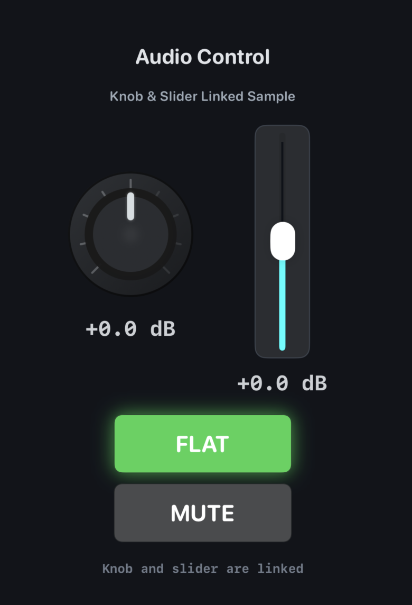
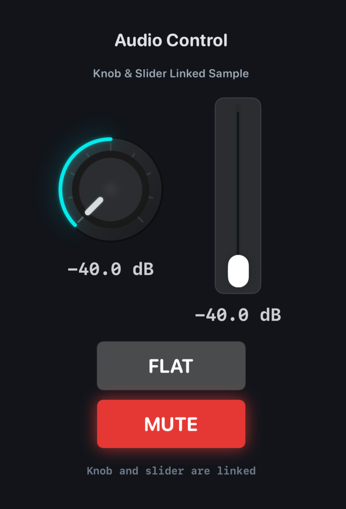

# SwiftUI Audio Control Kit

[](LICENSE)
[](https://developer.apple.com/ios/)
[](https://swift.org/)
[](https://developer.apple.com/swiftui/)

A sample project demonstrating how to build custom audio-style UI components in SwiftUI — a rotary **knob**, a vertical **slider**, and action **buttons** — all sharing the same value through data binding.

## Screenshot

 

## Features

- **Custom Rotary Knob** — drag-to-rotate with polar coordinate conversion, smoothing, and glow arc effect
- **Vertical Slider** — standard `Slider` rotated 90° with a custom track panel
- **Action Buttons** — `ButtonStyle`-based MUTE / FLAT toggle with animated state feedback
- **Linked Values** — knob, slider, and buttons share a single source of truth via `@Binding` and ViewModel
- **Design Token System** — all colors managed through `Assets.xcassets` colorsets, enabling easy theming and dark mode support

## Architecture

MVVM + Clean Architecture (Reducer pattern)

```
App/                        → Entry point, DI container
Domain/
  ├── Entities/             → AudioControlState, AudioControlSpec
  └── UseCases/             → AudioControlAction, AudioControlStateReducer
Application/UseCases/       → AudioControlUseCase (protocol), DefaultAudioControlUseCase
Presentation/
  ├── ViewModels/           → AudioControlViewModel
  └── Views/
      ├── Screens/          → AudioControlDemoScreen
      └── Components/       → AudioKnob, VerticalLinkedSlider, AudioActionButtonStyle
Shared/DesignSystem/        → AudioUIColorToken, AudioUIMetrics
```

## Requirements

- Xcode 26+
- iOS 26+ / iOS Simulator

## Getting Started

1. Open `SwiftUIButtonSample.xcodeproj` in Xcode
2. Select the `SwiftUIButtonSample` scheme
3. Choose a Simulator and press **Run**

## Customizing Colors

All colors are managed via Asset Catalog — no hardcoded color values in Swift code.

1. Edit colorsets in `Assets.xcassets` (e.g., `AudioAccent.colorset`, `AudioScreenBackground.colorset`)
2. The Swift side only references token names in `AudioUIDesignTokens.swift`

## License

MIT

---

# 日本語

SwiftUI でオーディオアプリ風の UI パーツ（ノブ・スライダー・ボタン）を作るサンプルプロジェクトです。
3 つの UI が同じ値を `@Binding` と ViewModel で共有・連携します。

## 主な特徴

- **カスタムノブ** — 極座標変換 + スムージング + 発光アーク
- **縦スライダー** — 標準 Slider を `rotationEffect(-90°)` で回転
- **アクションボタン** — `ButtonStyle` による MUTE / FLAT トグル
- **値の連携** — ノブ・スライダー・ボタンが ViewModel を通じて同期
- **デザイントークン** — 色は全て `Assets.xcassets` の colorset で管理。ダークモード対応も容易

## 設計

MVVM + クリーンアーキテクチャ（Reducer パターン）

- **Domain 層**: 状態 (`AudioControlState`) と純粋ロジック (`AudioControlStateReducer`)
- **Application 層**: UseCase プロトコルによる抽象化
- **Presentation 層**: ViewModel が UseCase を通じて状態を更新、View は描画に専念
- **App 層**: DI コンテナで依存関係を集約

## 色の変更方法

1. `Assets.xcassets` 内の各 colorset を編集（例: `AudioAccent.colorset`）
2. Swift コード側はトークン名のみを参照（`AudioUIDesignTokens.swift`）

## ライセンス

MIT
